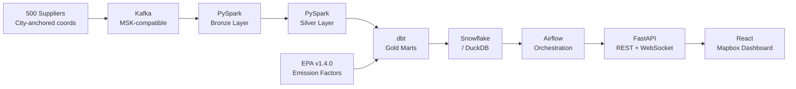
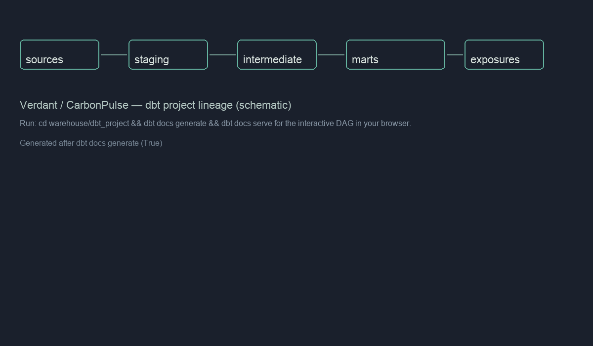

# Verdant — Scope 3 Carbon Intelligence Platform

Track carbon emissions across your supply chain — down to the supplier, shipment, and SKU.

**Live demo:** https://carbon-trace-8r4kifapt-nikhilgiridharans-projects.vercel.app

**Stack:** Kafka · PySpark · dbt · Airflow · Snowflake · FastAPI · React · Mapbox

**Data sources:**

- Emission factors: EPA Supply Chain GHG Emission Factors v1.4.0 (October 2025)
- Shipment data: Synthetically generated, calibrated to US Census 2024 trade patterns
- Supplier coordinates: City-anchored using real major industrial/port city locations

## Architecture



## Key Features

- Real-time supplier risk scoring (LightGBM, updates every 15 min)
- EPA v1.4.0 verified emission factors (2023 GHG data, IPCC AR6 GWPs)
- Interactive world map with 500 supplier nodes
- SKU-level emissions attribution via Sankey diagram
- 30/60/90-day emissions forecasting
- WebSocket live anomaly feed

## Team

- Data Engineer: pipeline, dbt models, API, infrastructure
- Data Scientist: LightGBM risk scoring, XGBoost forecasting, MLflow
- Supply Chain Analyst: EPA factor validation, KPI framework, Power BI

## Data Lineage



_Schematic generated after `dbt docs generate`. For the interactive DAG in your browser, run `cd warehouse/dbt_project && dbt docs generate && dbt docs serve`._

## Local Development

```bash
cp .env.example .env
docker compose up -d
make kafka-topics
make seed
# optional: open http://localhost:3080 (dashboard), http://localhost:8000/docs (API)
```

1. Copy env template and set `VITE_MAPBOX_TOKEN` for the map.
2. Start the stack.
3. Create Kafka topics.
4. Seed Postgres suppliers/SKUs/EPA factors.
5. Open UIs (dashboard on **3080** by default, API on **8000**). Set `DASHBOARD_PORT` in `.env` to use another port.

**Docker must be running** (Docker Desktop, etc.). If the dashboard URL refuses the connection, the dashboard container is not up—run `docker compose ps` and `docker compose logs dashboard`.

**Without full Docker**, run the API (Postgres required) and the Vite dev server on the same port as compose:

```bash
docker compose up -d postgres   # or full stack
cd api && uvicorn main:app --reload --host 0.0.0.0 --port 8000
# other terminal:
make ui                          # same port as DASHBOARD_PORT (default 3080); proxies /api to :8000
```

Additional targets:

```bash
make dbt-run     # requires local dbt + DuckDB profile in warehouse/dbt_project
make dbt-test
make quality
make test
```

## Environment variables

See [.env.example](.env.example) for the full list (Kafka, MinIO, Postgres, Snowflake, MLflow, Airflow, API, dashboard, AWS).

## API

- OpenAPI: `http://localhost:8000/docs`
- Health: `GET /health`
- Versioned REST: `/api/v1/...`
- WebSockets: `/ws/alerts`, `/ws/pipeline`

## Data sources (reference)

### Emission factors (EPA official)

**EPA Supply Chain GHG Emission Factors v1.4.0**

- Source: Ingwersen, W. and Young, B. (2025). Zenodo. https://doi.org/10.5281/zenodo.17202747
- Coverage: 1,016 U.S. commodities at NAICS-6 level
- GHG data year: 2023 | Dollar year: 2024 USD | GWP: IPCC AR6
- Factor type: Supply Chain Emission Factors with Margins (SEF+MEF)
- Transport mode factors used:
  - Air freight (NAICS 481112): 0.644 kg CO2e / 2024 USD
  - Deep sea ocean (NAICS 483111): 0.583 kg CO2e / 2024 USD
  - Long-haul trucking (NAICS 484121): 0.767 kg CO2e / 2024 USD
  - Line-haul rail (NAICS 482111): 0.154 kg CO2e / 2024 USD

### Shipment data (synthetic)

Shipment records are synthetically generated at configurable volume (default: 100 events/second). Supplier country distributions and transport mode weights are calibrated to reflect realistic U.S. import trade patterns. See `ingestion/producer/shipment_producer.py`.

### Supplier and SKU reference data

500 suppliers and 2,000 SKUs are generated with realistic attributes (company names, country distributions, industry classifications). See `ingestion/producer/shipment_producer.py` and `scripts/seed_neon.py` for Neon/demo loads.

> **Note on methodology:** CarbonPulse converts EPA cost-based factors (kg CO2e / USD) to physical factors (kg CO2e / tonne-km) using industry-average freight cost rates. Full derivation documented in `docs/decisions/ADR-003-emission-factors-methodology.md`.

## Links

- API docs (local): `http://localhost:8000/docs`
- Architecture: diagram above
- Live demo: https://carbon-trace-8r4kifapt-nikhilgiridharans-projects.vercel.app

## Medium article outline (draft)

1. **Problem** — Scope 3 boundaries, supplier fragmentation, latency needs.
2. **Architecture** — Kafka → Spark → Delta → dbt → serve.
3. **Data model** — Fact emissions + SCD2-ready supplier dimension.
4. **dbt** — Tests, lineage, separation from Spark transforms.
5. **Anomalies** — Streaming ingress + alerting surface.
6. **Dashboard** — Map + terminal UI patterns.
7. **Lessons** — Trade-offs (local DuckDB vs Snowflake, Airflow bootstrap).
8. **Links** — GitHub + demo.

## Resume bullets (fill brackets after measuring prod)

1. Architected a Scope 3 emissions platform ingesting **[X]M+** synthetic shipment events via Kafka → PySpark → S3-compatible storage → dbt, targeting sub-**[X] minute** refresh for demo stacks.
2. Modeled emissions in dbt with fact/dim tests and SCD-oriented supplier dimensions across **500** demo suppliers and **2000** SKUs.
3. Orchestrated health checks via Airflow-compatible DAG stubs, Great Expectations-style SQL gates, and pipeline status tables.
4. Shipped FastAPI + WebSocket feeds powering a Mapbox React dashboard with **20+** REST endpoints in the v1 surface.
